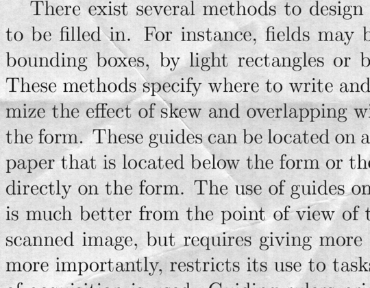
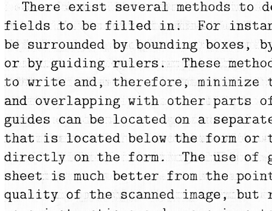
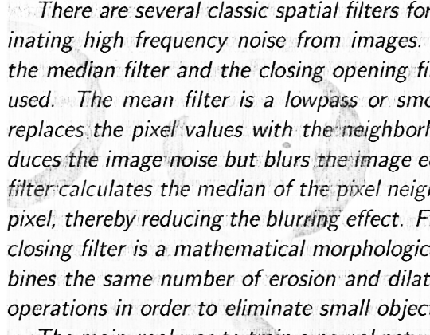
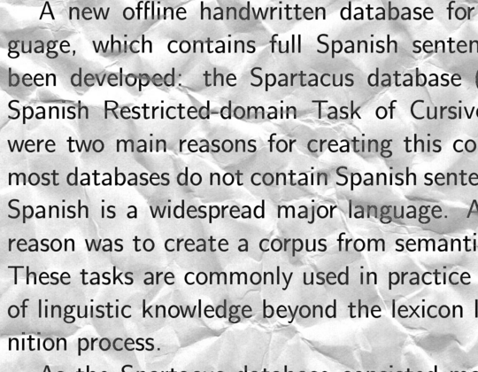
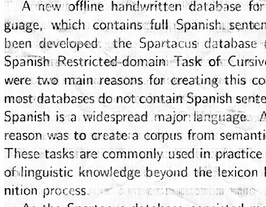

# Denoising of Documents

In this notebook Deep Neural Network is used to remove noise from images. The NN is implemented using TensorFLow and the dataset is obtained from Kaggle.

<a href = "https://www.kaggle.com/c/denoising-dirty-documents">Data Source</a>

<h3>Input & GIF of Ouput during Training</h3>

<h3>Outputs from Validation Set</h3>

<h3>Input & Predicted Output from Test Set</h3>
 

